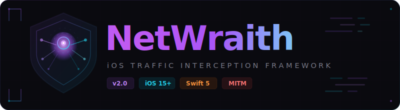

<p align="center">
  
</p>

<p align="center">
  <strong>Advanced iOS Traffic Interception Framework for Security Professionals</strong>
</p>

<p align="center">
  <a href="#installation"></a>
  <a href="#"></a>
  <a href="#"></a>
  <a href="LICENSE"></a>
</p>

<p align="center">
  <a href="#features">Features</a> &bull;
  <a href="#how-it-works">How It Works</a> &bull;
  <a href="#installation">Installation</a> &bull;
  <a href="#usage">Usage</a> &bull;
  <a href="#supported-traffic">Supported Traffic</a>
</p>

---

## What is NetWraith?

**NetWraith** is an iOS traffic interception framework that creates a system-wide VPN tunnel to route all device HTTP/HTTPS traffic through a configurable proxy server — primarily **Burp Suite**. Built natively in Swift with modern SwiftUI, zero dependencies, and purpose-built for mobile security researchers, penetration testers, and bug bounty hunters.

```
┌─────────────┐     ┌──────────────┐     ┌──────────────┐     ┌─────────────┐
│   iOS App   │────▶│  NetWraith   │────▶│  Burp Suite  │────▶│   Target    │
│ (any app)   │     │  VPN Tunnel  │     │  (Proxy)     │     │   Server    │
└─────────────┘     └──────────────┘     └──────────────┘     └─────────────┘
       ▲                    │                    │                     │
       └────────────────────┴────────────────────┴─────────────────────┘
                              Response Path
```

---

## Features

| Feature | Description |
|---------|-------------|
| **System-Wide Interception** | Routes ALL HTTP/HTTPS traffic through the proxy — not just browser traffic |
| **Burp Suite Integration** | One-tap connection to your Burp Suite listener for MITM analysis |
| **Native VPN Tunnel** | Uses Apple's `NEPacketTunnelProvider` for kernel-level traffic capture |
| **Flutter / WebView Support** | Intercepts traffic from Flutter, React Native, WebView, and native apps |
| **Certificate Pinning Bypass Ready** | Works alongside SSL Kill Switch / objection for pinned apps |
| **Real-Time Statistics** | Live data transfer monitoring (bytes in/out, uptime) |
| **Zero Dependencies** | Pure Swift — no CocoaPods, SPM packages, or third-party frameworks |
| **Thread-Safe** | `os_unfair_lock` protected proxy configuration and byte counters |
| **Dual Signing** | Supports both Apple Developer and `ldid` ad-hoc signing |
| **CI/CD Ready** | GitHub Actions builds and packages the IPA automatically |

---

## How It Works

NetWraith leverages Apple's **Network Extension** framework to create a packet tunnel VPN on the device. Here's the architecture:

```
┌──────────────────────────────────────────────────────────┐
│                     iOS Device                           │
│                                                          │
│  ┌──────────────┐    ┌─────────────────────────────────┐ │
│  │  NetWraith   │    │  PacketTunnelExtension          │ │
│  │  (Main App)  │◄──▶│  (NEPacketTunnelProvider)       │ │
│  │              │IPC │                                  │ │
│  │  - Config UI │    │  - Creates TUN interface         │ │
│  │  - Stats     │    │  - Sets HTTP/HTTPS proxy rules   │ │
│  │  - Controls  │    │  - Routes traffic to Burp        │ │
│  └──────────────┘    │  - DNS resolution (8.8.8.8)      │ │
│                      └──────────┬──────────────────────┘ │
│                                 │                        │
│  ┌──────────────────────────────▼───────────────────────┐│
│  │              iOS Network Stack                       ││
│  │  HTTP/HTTPS ──▶ Proxy (Burp) ──▶ Internet            ││
│  │  Other      ──▶ Direct ──▶ Internet                  ││
│  └──────────────────────────────────────────────────────┘│
└──────────────────────────────────────────────────────────┘
```

---

## Installation

### Prerequisites

- A **jailbroken iOS device** (with TrollStore or package manager) — OR — an **Apple Developer account** ($99/year)
- **Burp Suite** (Community or Professional) running on your computer
- Both device and computer on the **same network**

### Method 1: GitHub Actions (Recommended)

The easiest way — no Mac required.

1. **Fork this repository** on GitHub

2. **Push to `main`** or trigger the workflow manually:
   ```
   GitHub → Actions → "Build NetWraith IPA" → Run workflow
   ```

3. **Download the IPA** from the workflow artifacts

4. **Install on device:**

   | Device Type | Installation Method |
   |-------------|-------------------|
   | Jailbroken | Use **TrollStore**, **Filza**, or **AppSync Unified** |
   | Non-Jailbroken | Use **AltStore**, **Sideloadly**, or Xcode (requires Apple Developer signing) |

### Method 2: Build Locally (macOS)

```bash
# Clone the repository
git clone https://github.com/ShubhamDubeyy/NetWraith.git
cd NetWraith

# Install XcodeGen
brew install xcodegen

# Generate Xcode project
xcodegen generate

# Open in Xcode
open NetWraith.xcodeproj
```

Then build to your device via Xcode (requires signing configuration).

### Method 3: Pre-built IPA

Download the latest IPA from the [Releases](../../releases) page.

---

## Usage

### Step 1: Set Up Burp Suite

1. Open **Burp Suite** on your computer
2. Go to **Proxy → Options** (or **Proxy → Settings** in newer versions)
3. Add a listener:
   - **Bind to address:** All interfaces (or your LAN IP)
   - **Bind to port:** `8080`
4. Note your computer's **local IP address** (e.g., `192.168.1.100`)

### Step 2: Install Burp's CA Certificate on iOS

This is **required** for HTTPS interception:

1. On your iOS device, open Safari and navigate to `http://<YOUR_IP>:8080`
2. Tap **CA Certificate** to download it
3. Go to **Settings → General → VPN & Device Management** → Install the profile
4. Go to **Settings → General → About → Certificate Trust Settings** → Enable full trust for Burp's CA

### Step 3: Configure NetWraith

1. Open **NetWraith** on your iOS device
2. Enter your Burp Suite's **IP address** (e.g., `192.168.1.100`)
3. Enter the **port** (default: `8080`)
4. Tap **"Start Interception"**

### Step 4: Intercept Traffic

- Open any app on your device — its traffic will appear in **Burp Suite's HTTP History**
- Works with Safari, Chrome, native apps, Flutter apps, React Native apps, WebViews, and more
- Monitor live stats (data in/out) directly in NetWraith

### Step 5: Disconnect

- Tap **"Disconnect"** in NetWraith when done
- The VPN tunnel will be removed and traffic returns to normal

---

## Supported Traffic

| Traffic Type | Intercepted | Notes |
|-------------|:-----------:|-------|
| Safari / Browser | Yes | Full HTTP/HTTPS with Burp CA installed |
| Native iOS Apps | Yes | System-wide proxy applies |
| Flutter / React Native | Yes | VPN tunnel captures all traffic regardless of HTTP client |
| WebView Content | Yes | WebKit respects system proxy settings |
| WebSocket (ws/wss) | Yes | Proxied through HTTP CONNECT method |
| Certificate-Pinned Apps | Partial | Requires SSL Kill Switch 2 or objection |
| Raw TCP/UDP | No | Only HTTP/HTTPS proxy is configured |

---

## Author

**Shubham Dubey**

[](https://github.com/ShubhamDubeyy)
[](https://www.linkedin.com/in/shubham-dubeyy/)

